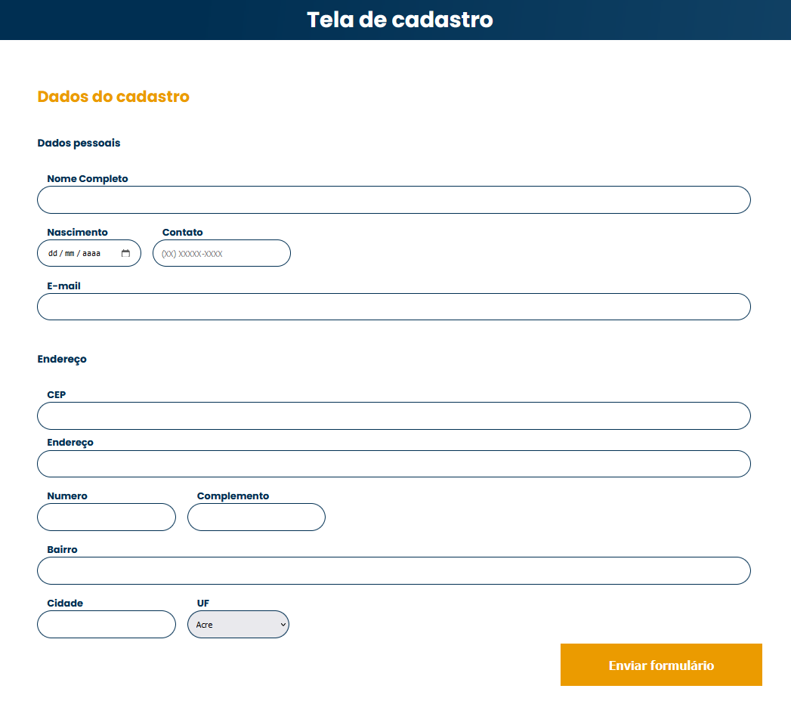

<h1 align="center"> AluraBooks - Cadastro </h1>

Tela de cadastro de usuário do AluraBooks 

  

 

## 🚀 Tecnologias

Esse projeto foi desenvolvido com as seguintes tecnologias:

- HTML
- CSS
- JavaScript,
- API ViaCEP
- Git e Github

## 💻 Projeto

O projeto AluraBooks - tela de cadastro, tem como objetivo ampliar os conhecimento quanto ao uso de APIs no JavaScript.  
Foi utilizado a API viacep, usada pra gerar um auto complite do endereço da pessoa, bastando informar apenas o CEP.  
A API ViaCEP pode ser acessada [neste link](https://viacep.com.br/)  
Além disso, foram feitas algumas validações básicas nos outros campos da tela de cadastro.

- [Visite o projeto online](https://mathfrlima.github.io/Alura-formulario-cadastro-cep/)

